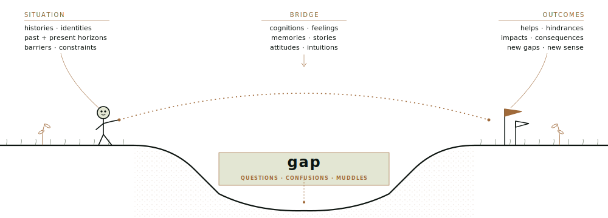

```{=html}
<div class="page-head">
  <div class="page-eyebrow">
    <svg width="48" height="48" viewBox="0 0 32 32" fill="none"><path d="M 16 2 L 16 14" stroke="#a06a3a" stroke-width="1.2"/><path d="M 16 14 Q 10 18, 8 28" stroke="#a06a3a" stroke-width="1" fill="none"/><path d="M 16 14 Q 22 18, 24 28" stroke="#a06a3a" stroke-width="1" fill="none"/><path d="M 16 14 L 16 28" stroke="#a06a3a" stroke-width="1"/><ellipse cx="13" cy="3" rx="2.5" ry="1.5" stroke="#a06a3a" stroke-width="0.8" fill="none"/><ellipse cx="19" cy="3" rx="2.5" ry="1.5" stroke="#a06a3a" stroke-width="0.8" fill="none"/></svg>
    <span>§ Theory · Foundations</span>
  </div>
  <div>
    <h1 class="page-title">The central metaphor</h1>
    <p class="page-dek">One picture holds the whole methodology — a person, a moment, a gap, the bridge they build to cross it.</p>
  </div>
</div>

<div class="page-body">

  <!-- Pull Quote -->
  <blockquote class="pull-quote">
    "Information is not simply a thing transmitted intact. In Sense-Making, it becomes useful when a person constructs it into help for moving across a gap."
    <span class="pull-quote-attr">— course paraphrase after Brenda Dervin</span>
  </blockquote>

  <!-- Plate I: The Central Metaphor -->
  <div class="metaphor-wrap">
    <div class="metaphor-plate">
      <svg width="12" height="12" viewBox="0 0 64 64" fill="none"><path d="M 32 6 L 32 58" stroke="#7a4d22" stroke-width="1"/><ellipse cx="32" cy="8" rx="3" ry="5" stroke="#7a4d22" stroke-width="0.8" fill="none"/></svg>
      <span>Plate I · The Central Metaphor</span>
    </div>

    

    <div class="metaphor-caption">
      A person, mid-stride in a moment of space-time, building a bridge across a gap — from situation, through the discontinuity, toward outcome.
      After Brenda Dervin, <span class="fig-ref">fig. C2.1</span>.
    </div>
  </div>

  <!-- Abstract front-matter card -->
  <div class="abstract-card corner-brackets">
    <span class="bracket-bl"></span><span class="bracket-br"></span>
    <span class="key">SUBJECT</span><span class="val">Brenda Dervin · Sense-Making Methodology (early 1970s–)</span>
    <span class="key">UNIT</span><span class="val">The gap — specific discontinuity, specific person, specific moment</span>
    <span class="key">METHOD</span><span class="val">Micro-Moment Time-Line Interview · neutral questioning</span>
    <span class="key">USE</span><span class="val">Survey design · UX research · funnel diagnosis · A/B post-mortem</span>
  </div>

  <!-- ═══════════════════════════════════════════════════ -->
  <!-- DEEP CONTENT: Collapsible Plates below the fold    -->
  <!-- ═══════════════════════════════════════════════════ -->

  <!-- Plate III: Seven Philosophical Assumptions -->
  <details class="plate">
    <summary>
      <span class="plate-n">Plate III</span>
      <span class="plate-title">Seven assumptions — course synthesis</span>
    </summary>
    <div class="plate-body">
      <p>These are not optional background — they are the premises this course uses to organise Dervin's methodological stance. Every design decision in SMM research should be checked against them. <em>Course synthesis across Dervin (1983, 1992, 1998) — not a direct enumeration from any single paper.</em></p>

      <div class="assumption">
        <span class="a-num">Assumption 01</span>
        <span class="a-title">Reality is discontinuous</span>
        <p>Gaps are not exceptions to be explained away — they are the fundamental condition of human experience. There is no complete knowledge, no final arrival, no state of full information. The person is always mid-crossing.</p>
      </div>
      <div class="assumption">
        <span class="a-num">Assumption 02</span>
        <span class="a-title">Information is constructed, not found</span>
        <p>There are no free-standing information objects. Information is always constructed in the act of bridging a gap in a specific situation. The same document bridges a gap for one person and fails entirely for another because their situations differ.</p>
      </div>
      <div class="assumption">
        <span class="a-num">Assumption 03</span>
        <span class="a-title">Situation is constitutive, not contextual</span>
        <p>The specific time-space context determines what counts as a gap, what bridges are available, and what outcomes are possible. Situation is not background colour — it is the operative ground of all sense-making activity.</p>
      </div>
      <div class="assumption">
        <span class="a-num">Assumption 04</span>
        <span class="a-title">People are active sense-makers, not passive receivers</span>
        <p>The human being is the agent constructing bridges using internal resources (memory, emotion, knowledge) and external resources (information, people, systems). No one receives meaning — they build it.</p>
      </div>
      <div class="assumption">
        <span class="a-num">Assumption 05</span>
        <span class="a-title">Universal procedure; unique instance</span>
        <p>Everyone sense-makes (universal), but the specific sense made is irreducibly unique to that person's situation and moment. This is what makes cautious cross-case comparison possible — recurring structures can be compared, while the content remains situated and individual.</p>
      </div>
      <div class="assumption">
        <span class="a-num">Assumption 06</span>
        <span class="a-title">Subjectivity is datum, not noise</span>
        <p>Confusion, emotion, and intuition are what SMM is designed to capture — not artefacts to be controlled for. When a participant says "I felt lost," that is primary data about the stop they experienced, not a measurement error.</p>
      </div>
      <div class="assumption">
        <span class="a-num">Assumption 07</span>
        <span class="a-title">Both internal and external orders are real</span>
        <p>Neither pure subjectivism nor pure objectivism is adequate. SMM operates in the space between — the gap is real (external order), but the bridge that crosses it is constructed (internal order). Both matter for design.</p>
      </div>
    </div>
  </details>

  <!-- Plate IV: Sense-Unmaking -->
  <details class="plate">
    <summary>
      <span class="plate-n">Plate IV</span>
      <span class="plate-title">Sense-unmaking</span>
    </summary>
    <div class="plate-body">
      <p>In later work, Dervin foregrounded <strong>sense-unmaking</strong> — the recognition that people may also need to <em>dismantle</em>, challenge, or loosen existing sense structures. This is not merely the failure of sense-making. It is part of how sense-making changes over time.</p>

      <blockquote>Course paraphrase: people sometimes need to unlearn, challenge assumptions, or destabilise established understandings before new sense can be made.</blockquote>

      <p>Sense-unmaking is particularly relevant for transformative learning, organisational change, critical consciousness, and creative work. In later SMM writing, Dervin connects making and unmaking sense to power: some sense structures are imposed, and people may need to challenge or undo them in order to move.</p>

      <p>Course application for analytics practitioners: a redesign can disrupt users' established sense of an interface. Users had workable sense of the old design; the redesign may unsettle that sense and create new gaps. Support ticket spikes after a product launch are often worth reading this way: telemetry shows the event, and SMM helps ask what sense was unmade.</p>

      <div class="smm-callout-box warn">
        <strong>Common mistake</strong>
        Treating SMM as purely constructive misses resistance, confusion, and transformative learning — contexts where old sense must be dismantled before new sense can be made.
      </div>
    </div>
  </details>

  <!-- Plate V: SMM vs. the Transmission Model -->
  <details class="plate">
    <summary>
      <span class="plate-n">Plate V</span>
      <span class="plate-title">SMM vs. the transmission model</span>
    </summary>
    <div class="plate-body">
      <p>Dervin's core critique: the transmission model assumes meaning inheres in messages — that the same message means the same thing to all receivers. SMM challenges that assumption by asking how people in different situations construct different helps, hindrances, and uses. A transfer-only design frame is therefore inadequate.</p>

      <table class="compare-table">
        <thead><tr><th>Dimension</th><th>Transmission Model</th><th>Sense-Making Methodology</th></tr></thead>
        <tbody>
          <tr><td>Ontology</td><td>Information exists independently as an objective thing</td><td>Information is constructed in the act of bridging — always relational</td></tr>
          <tr><td>Human role</td><td>Passive receiver / decoder</td><td>Active sense-maker constructing bridges</td></tr>
          <tr><td>Model</td><td>Linear: Source → Message → Channel → Receiver</td><td>Situational and recursive: Situation → Gap → Bridge/Help → Outcome/Use → New Situation</td></tr>
          <tr><td>Unit of analysis</td><td>The message or information object</td><td>The gap: specific discontinuity in a specific situation</td></tr>
          <tr><td>Success</td><td>Accurate transmission: did the message arrive intact?</td><td>Effective bridging: did the person cross the gap in a way that helped?</td></tr>
          <tr><td>Context</td><td>Noise to be reduced</td><td>Constitutive: determines what a gap is and what bridges are possible</td></tr>
        </tbody>
      </table>
    </div>
  </details>

  <!-- Plate VI: Comparative Analysis -->
  <details class="plate">
    <summary>
      <span class="plate-n">Plate VI</span>
      <span class="plate-title">Comparative analysis — SMM and neighbouring frameworks</span>
    </summary>
    <div class="plate-body">
      <p>SMM is not the only sense-making framework, and it is not always the right one. Understanding where it overlaps with and diverges from neighbouring approaches helps practitioners know when to reach for it.</p>

      <table class="compare-table">
        <thead><tr><th>Framework</th><th>Primary Unit</th><th>Time</th><th>Key Difference</th><th>Best Integration with SMM</th></tr></thead>
        <tbody>
          <tr><td>Weickian Sensemaking</td><td>Organisation / collective</td><td>Retrospective</td><td>Organisational, not individual; less methodologically specific</td><td>Weick for collective context (situation); Dervin for individual gap-bridging within it</td></tr>
          <tr><td>Design Thinking</td><td>Problem-solution cycle</td><td>Prospective</td><td>Generative not diagnostic; "empathy" framing can be shallow</td><td>SMM for rigorous gap diagnosis in DT phases 1–2; DT ideation for designing bridges</td></tr>
          <tr><td>User Journey Mapping</td><td>Touchpoints across timeline</td><td>Both</td><td>Often persona-based, not grounded in specific moments; atheoretical</td><td>SMM interviews generate empirically grounded data that journey maps then visualise</td></tr>
          <tr><td>Systems Thinking</td><td>Feedback loops / system structure</td><td>Both</td><td>Macro not micro; individual agency under-theorised</td><td>Systems Thinking for why gaps are endemic; SMM for how individuals navigate them</td></tr>
          <tr><td>Ethnographic Interviewing</td><td>Cultural practice / thick description</td><td>Synchronic</td><td>Richer cultural context; weaker cross-case comparability</td><td>Ethnographic immersion for situational context; MMTLI for systematic gap-bridge-outcome mapping</td></tr>
        </tbody>
      </table>
    </div>
  </details>

  <!-- SGBO Section Head -->
  <div class="sgbo-section-head">
    <div class="sgbo-n">
      <svg width="56" height="56" viewBox="0 0 32 32" fill="none"><path d="M 16 2 L 16 14" stroke="#a06a3a" stroke-width="1.2"/><path d="M 16 14 Q 10 18, 8 28" stroke="#a06a3a" stroke-width="1" fill="none"/><path d="M 16 14 Q 22 18, 24 28" stroke="#a06a3a" stroke-width="1" fill="none"/><path d="M 16 14 L 16 28" stroke="#a06a3a" stroke-width="1"/><ellipse cx="13" cy="3" rx="2.5" ry="1.5" stroke="#a06a3a" stroke-width="0.8" fill="none"/><ellipse cx="19" cy="3" rx="2.5" ry="1.5" stroke="#a06a3a" stroke-width="0.8" fill="none"/></svg>
      <span>§ The Constitution</span>
    </div>
    <div>
      <h2 class="sgbo-title">Situation → Gap → Bridge → Outcome</h2>
      <div class="sgbo-sub">A course teaching shorthand for the movement from situation, through discontinuity, toward helps, hurts, uses, and new situations.</div>
    </div>
  </div>


  <div class="smm-callout-box" style="margin:24px 0;">
    <strong>Academic note</strong>
    Situation → Gap → Bridge → Outcome is the shorthand used in this course for teaching and practice. Dervin's early formulations often foreground situations, gaps, and uses/helps; later summaries and applications make bridge and outcome language more explicit. Read SGBO here as a practitioner map across Dervin's work, not as a claim that every period of her writing used the exact same four labels.
  </div>

  <!-- Plate II: The Constitution (dark diagram) -->
  <div class="diag-wrap">
    <div class="diag-plate">
      <svg width="14" height="14" viewBox="0 0 32 32" fill="none"><path d="M 16 2 L 16 14" stroke="#f5f1e3" stroke-width="1.2"/><path d="M 16 14 Q 10 18, 8 28" stroke="#f5f1e3" stroke-width="1" fill="none"/><path d="M 16 14 Q 22 18, 24 28" stroke="#f5f1e3" stroke-width="1" fill="none"/></svg>
      <span>Plate II · The Constitution</span>
      <svg width="14" height="14" viewBox="0 0 32 32" fill="none"><path d="M 16 2 L 16 14" stroke="#f5f1e3" stroke-width="1.2"/><path d="M 16 14 Q 10 18, 8 28" stroke="#f5f1e3" stroke-width="1" fill="none"/><path d="M 16 14 Q 22 18, 24 28" stroke="#f5f1e3" stroke-width="1" fill="none"/></svg>
    </div>
    <div class="diag-frame">
      <div class="diag-grid">
        <div class="diag-station">
          <svg width="28" height="28" viewBox="0 0 32 32" fill="none"><circle cx="16" cy="16" r="6" stroke="#7ab685" stroke-width="1.2"/><circle cx="16" cy="16" r="3" fill="#7ab685"/><line x1="16" y1="3" x2="16" y2="7" stroke="#7ab685" stroke-width="1"/><line x1="16" y1="25" x2="16" y2="29" stroke="#7ab685" stroke-width="1"/><line x1="3" y1="16" x2="7" y2="16" stroke="#7ab685" stroke-width="1"/><line x1="25" y1="16" x2="29" y2="16" stroke="#7ab685" stroke-width="1"/></svg>
          <span class="diag-station-n">· I · Situation</span>
          <span class="diag-station-label" style="color:#7ab685">Where you are</span>
          <span class="diag-station-desc">Specific time-space context. The ground itself.</span>
          <div class="diag-hints"><span>· person in a moment</span><span>· what came before</span></div>
        </div>
        <div class="diag-station">
          <svg width="28" height="28" viewBox="0 0 32 32" fill="none"><ellipse cx="16" cy="16" rx="6" ry="10" stroke="#d4b86a" stroke-width="1.2"/><line x1="16" y1="6" x2="16" y2="26" stroke="#d4b86a" stroke-width="0.8"/></svg>
          <span class="diag-station-n">· II · Gap</span>
          <span class="diag-station-label" style="color:#d4b86a">What stops you</span>
          <span class="diag-station-desc">The discontinuity. Question, confusion, barrier, dilemma.</span>
          <div class="diag-hints"><span>· situated stops</span><span>· not a failure: the engine</span></div>
        </div>
        <div class="diag-station">
          <svg width="28" height="28" viewBox="0 0 32 32" fill="none"><path d="M16 2 C 8 8, 6 18, 16 30 C 26 18, 24 8, 16 2 Z" stroke="#5e9c6f" stroke-width="1.2"/><path d="M16 4 L 16 28" stroke="#5e9c6f" stroke-width="0.8"/></svg>
          <span class="diag-station-n">· III · Bridge</span>
          <span class="diag-station-label" style="color:#5e9c6f">What you build</span>
          <span class="diag-station-desc">Any resource: ideas, memories, people, procedures.</span>
          <div class="diag-hints"><span>· information is one type</span><span>· not always available</span></div>
        </div>
        <div class="diag-station" style="border-right:none">
          <svg width="28" height="28" viewBox="0 0 32 32" fill="none"><circle cx="6" cy="16" r="3" stroke="#a3d4b9" stroke-width="0.8" fill="none"/><path d="M 6 13 a 3 3 0 0 1 0 6 a 1.5 3 0 0 0 0 -6 z" fill="#a3d4b9"/><circle cx="16" cy="16" r="4" stroke="#a3d4b9" stroke-width="1" fill="#a3d4b9" fill-opacity=".18"/><circle cx="26" cy="16" r="3" stroke="#a3d4b9" stroke-width="0.8" fill="none"/><path d="M 26 13 a 3 3 0 0 0 0 6 a 1.5 3 0 0 1 0 -6 z" fill="#a3d4b9"/></svg>
          <span class="diag-station-n">· IV · Outcome</span>
          <span class="diag-station-label" style="color:#a3d4b9">What happens</span>
          <span class="diag-station-desc">Helps · hurts · new gap. Shapes the next situation.</span>
          <div class="diag-hints"><span>· symmetric data</span><span>· loops back</span></div>
        </div>
      </div>
      <div class="diag-arc">
        The recursive arc — <span class="neon-hl">course visualisation</span>:
        an outcome may help, hurt, or destabilise existing sense, becoming part of the next situation. The loop never closes.
      </div>
    </div>
  </div>

  <!-- Plate VII: Primary Sources -->
  <details class="plate">
    <summary>
      <span class="plate-n">Plate VII</span>
      <span class="plate-title">Bibliography & recommended reading</span>
    </summary>
    <div class="plate-body">
      <p>Dervin's core works, in order of where to start. All citations should be verified against library databases before formal use — full publication details are given where confirmed.</p>

      <div class="smm-callout-box" style="margin-bottom:20px;">
        <strong>Start here</strong>
        Dervin, B. (1992). "From the mind's eye of the user: The sense-making qualitative-quantitative methodology." In J. D. Glazier & R. R. Powell (Eds.), <em>Qualitative Research in Information Management</em> (pp. 61–84). Englewood, CO: Libraries Unlimited. — The most accessible single-paper introduction to the qualitative-quantitative methodology, situational questioning, gaps, and uses/helps. If you read one thing, read this.
      </div>

      <table class="compare-table">
        <thead><tr><th>Work</th><th>Where to Find It</th><th>What It Contributes</th></tr></thead>
        <tbody>
          <tr>
            <td>Dervin, B. (1983)</td>
            <td>"Information as a user construct: The relevance of perceived information needs to synthesis and interpretation." In S. Ward & L. Reed (Eds.), <em>Knowledge Structure and Use</em>. Philadelphia: Temple University Press.</td>
            <td>Foundational statement. Introduces core Sense-Making premises, perceived information needs, and the critique of information-as-transmission. Foundational for the gap/bridge metaphor and later SMM formulations.</td>
          </tr>
          <tr>
            <td>Dervin, B., & Nilan, M. (1986)</td>
            <td>"Information needs and uses." <em>Annual Review of Information Science and Technology</em>, 21, 3–33.</td>
            <td>Landmark paradigm critique. Establishes the shift from topic-based to gap-based research across the field. Places SMM in the broader context of information science's methodological turn.</td>
          </tr>
          <tr>
            <td>Dervin, B. (1992)</td>
            <td>See callout above.</td>
            <td><strong>Best single overview.</strong> Full S-G-B-O articulation. Start here.</td>
          </tr>
          <tr>
            <td>Dervin, B. (1998)</td>
            <td>"Sense-making theory and practice: An overview of user interests in knowledge seeking and use." <em>Journal of Knowledge Management</em>, 2(2), 36–46.</td>
            <td>Mature statement of the framework. Introduces sense-unmaking explicitly. Connects SMM to power, feminist epistemology, and critical theory. The paper where Dervin sharpens her edge.</td>
          </tr>
          <tr>
            <td>Dervin, B. (1999)</td>
            <td>"On studying information seeking methodologically: The implications of connecting metatheory to method." <em>Information Processing & Management</em>, 35(6), 727–750.</td>
            <td>The deepest methodological discussion. Best single source on MMTLI design, neutral questioning, and qualitative analysis protocol. Essential for anyone designing SMM research.</td>
          </tr>
          <tr>
            <td>Dervin, B., & Foreman-Wernet, L. (Eds.) (2003)</td>
            <td><em>Sense-Making Methodology Reader: Selected Writings of Brenda Dervin</em>. Cresskill, NJ: Hampton Press.</td>
            <td>The essential collection. Gathers Dervin's key papers across three decades with editorial commentary. If you want the full arc of the methodology's development, this is the single volume to own.</td>
          </tr>
        </tbody>
      </table>

      <div style="margin-top:28px;padding-top:20px;border-top:1px dotted rgba(160,106,58,.3);">
        <p style="font-family:'IBM Plex Mono',monospace;font-size:10px;letter-spacing:.18em;text-transform:uppercase;color:#a06a3a;margin-bottom:12px;">Contextual reading — beyond Dervin</p>

        <table class="compare-table">
          <thead><tr><th>Work</th><th>Why It Matters</th></tr></thead>
          <tbody>
            <tr>
              <td>Weick, K. E. (1995). <em>Sensemaking in Organizations</em>. Thousand Oaks, CA: Sage.</td>
              <td>The organisational sensemaking counterpart to Dervin's individual framework. Essential for understanding what SMM is not — retrospective, collective, enacted — and where the two frameworks complement rather than compete.</td>
            </tr>
            <tr>
              <td>Savolainen, R. (1993). "The sense-making theory: Reviewing the interests of a user-centered approach to information seeking and use." <em>Information Processing & Management</em>, 29(1), 13–28.</td>
              <td>The best secondary literature overview of SMM for practitioners new to the information science context. Places Dervin relative to Wilson and other information behaviour theorists.</td>
            </tr>
            <tr>
              <td>Wilson, T. D. (1997). "Information behaviour: An interdisciplinary perspective." <em>Information Processing & Management</em>, 33(4), 551–572.</td>
              <td>The broadest map of information behaviour research. Situates SMM within the wider field and helps practitioners understand which problems SMM is and isn't designed to solve.</td>
            </tr>
            <tr>
              <td>Chatman, E. A. (1991). "Life in a small world: Applicability of gratification theory to information-seeking behavior." <em>Journal of the American Society for Information Science</em>, 42(6), 438–449.</td>
              <td>Complements Dervin's framework with research on information poverty and how social context shapes what gaps people even allow themselves to have. Important for research involving marginalised or resource-constrained populations.</td>
            </tr>
          </tbody>
        </table>
      </div>

      <div style="margin-top:32px;padding:24px 28px;border:1px solid rgba(160,106,58,.4);background:rgba(12,20,16,.04);position:relative;">
        <div style="position:absolute;top:-10px;left:24px;background:#dde0cf;padding:0 10px;font-family:'IBM Plex Mono',monospace;font-size:9px;letter-spacing:.2em;text-transform:uppercase;color:#a06a3a;">In memoriam</div>
        <p style="font-family:'Cormorant Garamond','EB Garamond',Georgia,serif;font-size:20px;font-style:italic;font-weight:500;color:#0c1410;line-height:1.3;margin:0 0 12px;">Brenda Dervin<span style="font-style:normal;font-size:14px;font-family:'IBM Plex Mono',monospace;letter-spacing:.08em;color:#a06a3a;margin-left:14px;">1938 – 2023</span></p>
        <p style="font-family:'IBM Plex Serif',Georgia,serif;font-size:14px;line-height:1.7;color:#3a4a3f;margin:0;">Distinguished Professor of Social and Behavioral Sciences and Journalism at Ohio State University. She developed Sense-Making Methodology over fifty years of research into how people construct understanding across the discontinuities of lived experience. The methodology outlasted every institutional context it was built in and remains in active use in information science, UX research, communication studies, and organisational analysis. This site is dedicated to keeping her work in the hands of practitioners who need it.</p>
      </div>

      <div class="smm-callout-box warn" style="margin-top:20px;">
        <strong>Note on citation accuracy</strong>
        These citations have been compiled from published secondary sources and should be verified against library databases (JSTOR, ACM Digital Library, Google Scholar) before formal academic use. Volume and page numbers are given where confirmed; treat others as indicative.
      </div>
    </div>
  </details>

</div>
```
